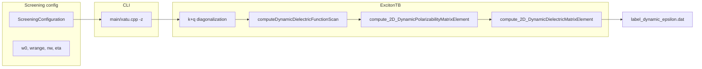

# Dynamic dielectric function (single element, 2D)

Implementation plan for frequency-dependent RPA screening. Scope: single matrix element ε_{G,G'}(q,ω) with ω scan at fixed q; pure 2D formulation only.

## Context

Static RPA screening is already implemented in [`src/ExcitonTB.cpp`](../src/ExcitonTB.cpp). The pure 2D polarizability matrix element sums over k, valence, and conduction bands:

```1568:1568:src/ExcitonTB.cpp
                term += IvcG*std::conj(IvcG2) / (eigvalkqStack_.col(ik)(iv) - eigvalkStack_.col(ik)(ic));
```

The dielectric element follows RPA:

```1664:1672:src/ExcitonTB.cpp
std::complex<double> ExcitonTB::compute_2D_DielectricMatrixElement(...) {
    ...
    std::complex<double> epsilon = kroneckerdelta - potential*this->compute_2D_PolarizabilityMatrixElement(G,G2,q);
```

The CLI path `-z` with `function = dielectric` in [`main/xatu.cpp`](../main/xatu.cpp) calls `computesingleDielectricFunctionMatrixElement()`, which uses a **different** polarizability routine (`computesinglePolarizabilityMatrixElement`, vc+cv terms). For this task (pure 2D, single element), implement the dynamic analogue of **`compute_2D_PolarizabilityMatrixElement`** + **`compute_2D_DielectricMatrixElement`**, and wire it as a new screening mode.

The codebase already has a retarded propagator helper in [`src/utils.cpp`](../src/utils.cpp) (`rGreenF`), but its argument order does not match the static denominator `ΔE = E_v(k+q) - E_c(k)` without sign fixes. Prefer an explicit, documented helper to avoid subtle sign/broadening bugs.

## Physics (target)

For each ω on a uniform grid:

- **Polarizability (2D, T=0):**
  χ⁰_{GG'}(q,ω) = (g_s · 2 / N_k) Σ_{k,c,v} I_vc(G) I*_vc(G') / (E_v(k+q) - E_c(k) + ω + iη)
  (same band/orbital loop and `blochCoherenceFactor` as `compute_2D_PolarizabilityMatrixElement`)

- **Dielectric (RPA):**
  ε_{GG'}(q,ω) = δ_{GG'} - v(q+G) v(q+G') χ⁰_{GG'}(q,ω)
  with `potential = coulomb_2D_FT(q+G)*coulomb_2D_FT(q+G2)` as in the static 2D case.

**Sanity check:** at ω = 0 and η → 0⁺, result should approach the static `compute_2D_DielectricMatrixElement` (within numerical tolerance).

## Architecture



## Implementation steps

### 1. Screening configuration — frequency grid

**Files:** [`include/xatu/ScreeningConfiguration.hpp`](../include/xatu/ScreeningConfiguration.hpp), [`src/ScreeningConfiguration.cpp`](../src/ScreeningConfiguration.cpp)

Add optional fields to `screeningInfo`:

| Field | Default | Meaning |
|-------|---------|---------|
| `w0` | 0.0 | Start frequency (eV) |
| `wrange` | 0.0 | Span (eV); grid is `w0 + i * wrange/(nw-1)` |
| `nw` | 1 | Number of ω points |
| `eta` | 0.05 | Lorentzian broadening (eV) |

Parse new optional keys (mirror [`kubo_w.in`](../kubo_w.in) naming):

- `frequency.initial`, `frequency.range`, `frequency.points`, `broadening`

Extend `checkContentCoherence()`:

- Require `nw >= 1`, `eta > 0`, `wrange >= 0`
- When `function == "dynamic_dielectric"`, require `nw >= 2` for a meaningful scan

Add `"dynamic_dielectric"` to the allowed `function` values list.

### 2. Core polarizability / dielectric methods

**Files:** [`include/xatu/ExcitonTB.hpp`](../include/xatu/ExcitonTB.hpp), [`src/ExcitonTB.cpp`](../src/ExcitonTB.cpp)

Add:

```cpp
std::complex<double> compute_2D_DynamicPolarizabilityMatrixElement(
    const arma::rowvec& G, const arma::rowvec& G2, const arma::rowvec& q,
    double omega, double eta);

std::complex<double> compute_2D_DynamicDielectricMatrixElement(
    const arma::rowvec& G, const arma::rowvec& G2, const arma::rowvec& q,
    double omega, double eta);

void computeDynamicDielectricFunctionScan(const std::string& label);
```

Replace static denominator with `deltaE + std::complex<double>(omega, eta)`.

Optional helper in utils:

```cpp
inline std::complex<double> interbandPropagator(double deltaE, double omega, double eta) {
    return 1.0 / (deltaE + std::complex<double>(omega, eta));
}
```

**`computeDynamicDielectricFunctionScan`:** Mirror `computesingleDielectricFunctionMatrixElement` setup; loop ω; write `{label}_dynamic_epsilon.dat`.

### 3. CLI integration

**File:** [`main/xatu.cpp`](../main/xatu.cpp)

```cpp
} else if (screeningConfig->screeningInfo.function == "dynamic_dielectric") {
    bulkExciton.computeDynamicDielectricFunctionScan(excitonConfig->excitonInfo.label);
    return 0;
}
```

### 4. Example screening config

```
function dynamic_dielectric
momentum 0.2 0.0 0.0
vectors 0 0
valence.bands 4
conduction.bands 4
ncell_aux 17
gcutoff 10.0
frequency.initial 0.0
frequency.range 6.0
frequency.points 400
broadening 0.08
```

Run: `./bin/xatu -z model.screening system.txt exciton.txt`

### 5. Validation (manual)

1. Static limit: `nw=1`, `w0=0`, `eta=1e-4` vs `compute_2D_DielectricMatrixElement`
2. Im(ε) broadens with larger η
3. `make build && make xatu`

## Out of scope

- Full (q,ω) BZ mesh
- Quasi-2D
- Dynamic ε in RPA BSE potential
- Gaussian/exponential broadening

## Risk note

`computesingleDielectricFunctionMatrixElement` uses vc+cv polarizability; BZ mesh uses pure 2D (vc only). Dynamic code follows **pure 2D** per design choice.

## Todos

- [ ] Add w0, wrange, nw, eta to ScreeningConfiguration; allow `function=dynamic_dielectric`
- [ ] Implement `compute_2D_DynamicPolarizabilityMatrixElement` and `compute_2D_DynamicDielectricMatrixElement`
- [ ] Implement `computeDynamicDielectricFunctionScan`
- [ ] Add `dynamic_dielectric` branch in `main/xatu.cpp`
- [ ] Verify ω→0 matches static 2D element
